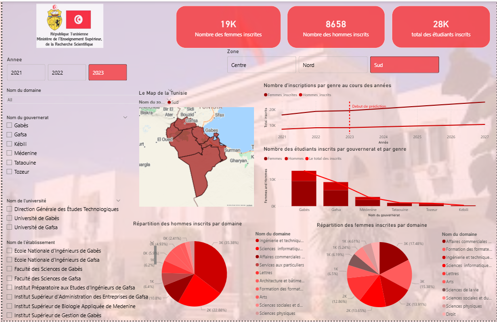

# 🎓 Inscriptions Universitaire Dashboard

This project analyzes university enrollment data using Power BI.

## 📊 Dashboard Preview

## 📝 Description
This dashboard shows:
- Number of student registrations
- Distribution by university
- Trends over time
- Key insights for decision-making

## 📂 Files
- `Dashboard Inscriptions.pbix` → Power BI file
- `Inscriptions.csv` → dataset
